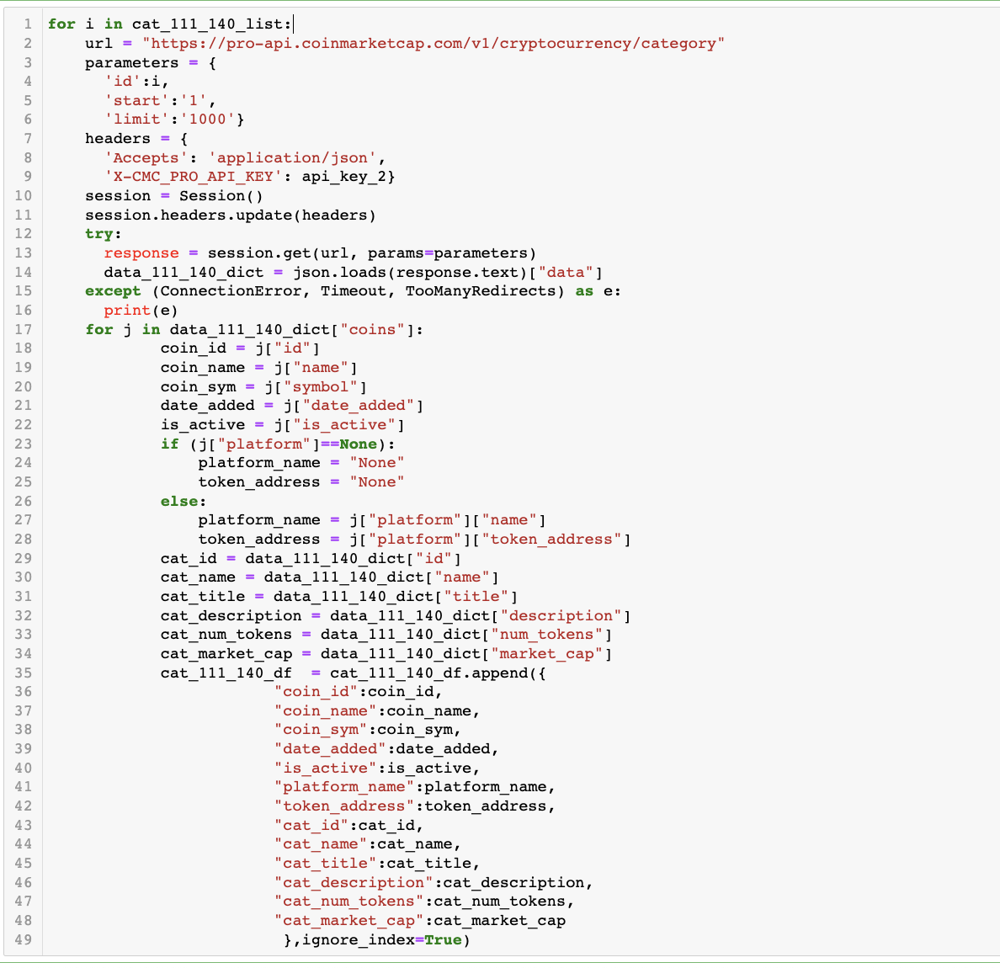
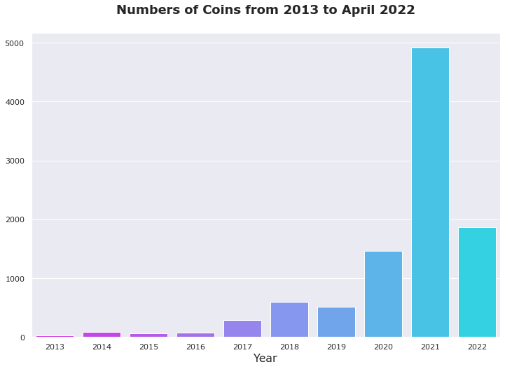
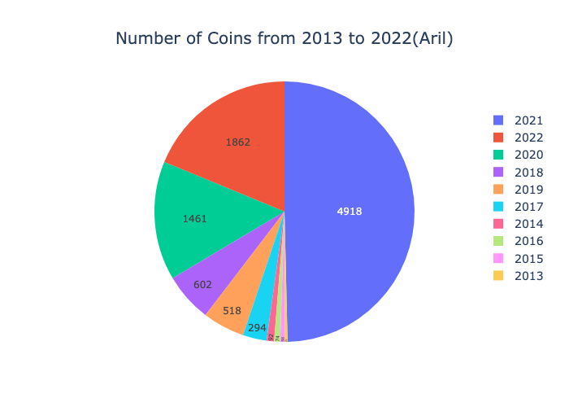
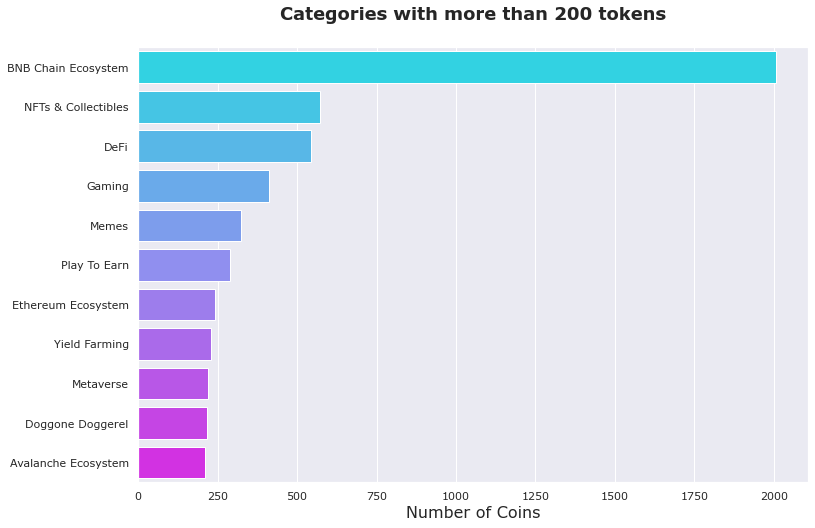
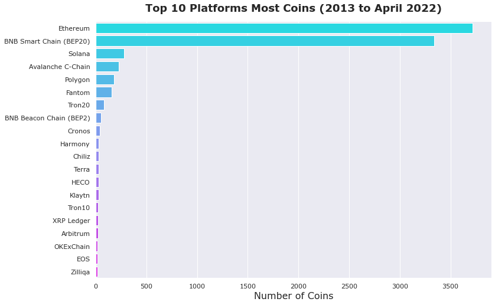
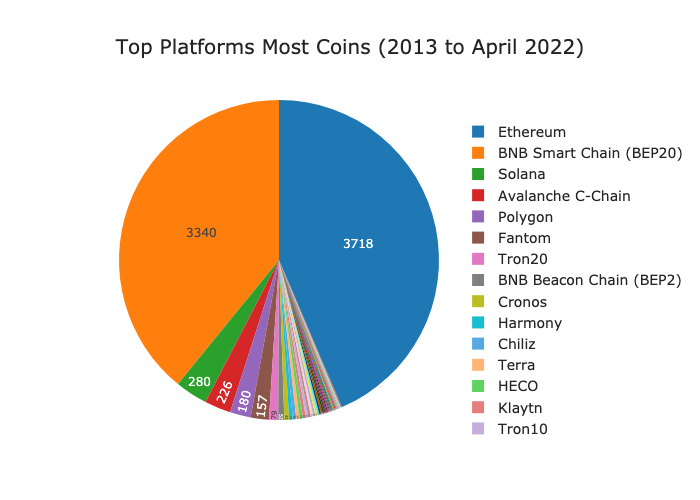
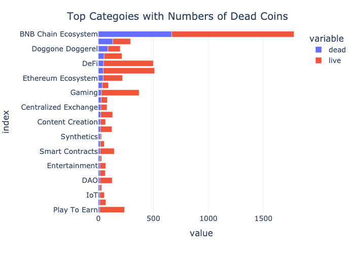
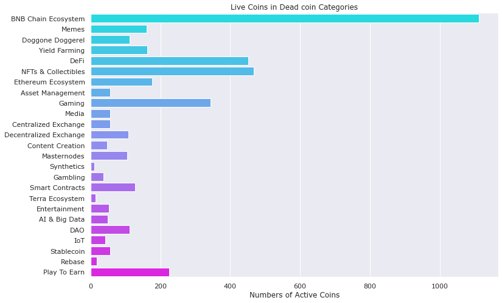
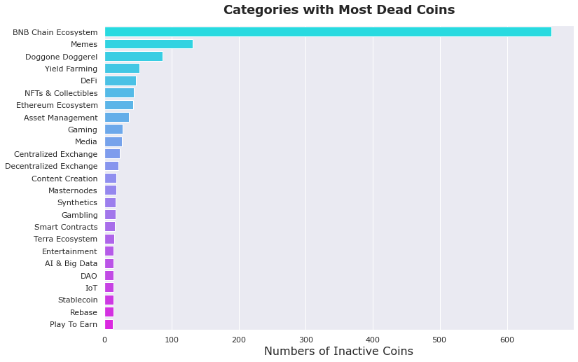
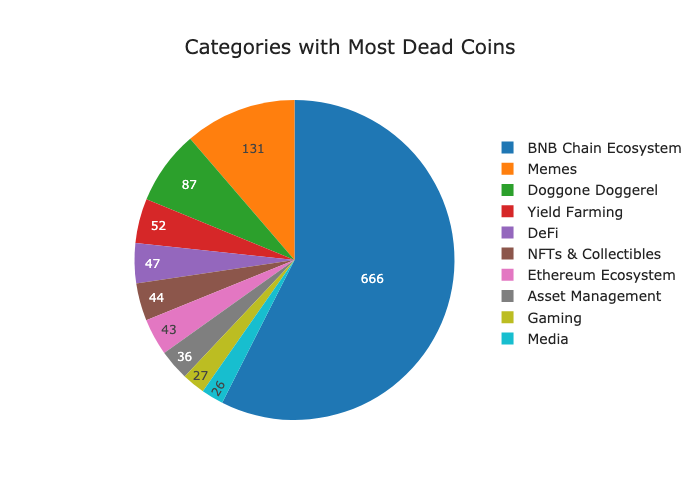

# Data Collection & Preprocessing: CoinMarketCap

## Overview

The main goals of this project are:
* Getting data from API
* Creating my own dataset
* Finding information from the dataset
* Finding what machine learning model(s) could be used for the dataset
* Finding insights, possible actionable insights, and hopefully business application from the project

## Data Source and Preparation :astonished:

**Three CoinMarketCap API endpoints**
* Category Endpoint: About 10,000 coins
* Categories Endpoint: 154 categories
* Listing Latest Endpoint: About 10,000 coins
* Data pulled in April 2022

## Insights :fire:
* 2021 has most coins listed on CoinMarketcap
* Number of coins in 2021 alone is 50% of total coins listed since 2013
* 2021 was the peek of crypto market
* BNB chain and NFTs are categories that have most coins
* Ethereum and BNB Smart Chain are platforms that have most coins 
* **As of April 2022, more than *half of Inactive coins are in BNB Chain Ecosystem!**
* **BNB Chain, Memes, and Doggone Doggerel are three categories that have Inactive/Dead coins**

## Possible Actionable Insights and Possible Business Application:fire:

* See big picture of number of coins, categories, platforms in cryptocurrency market
* Help retail investors/users whether or not to invest in coins which are in categrories/platforms that are most likely to be dead coins
* **Avoid investing in categories most dead coin!!**

## Visualization

___

___

